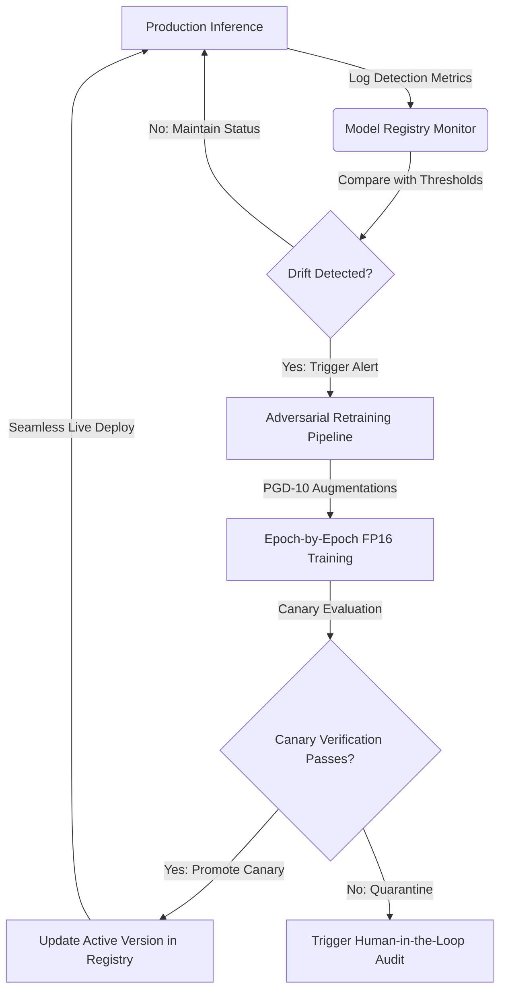

# 🗃️ Deepfake Shield Model Zoo & Continuous Learning Engine

The **Model Zoo** is the continuous model registry, monitoring, and automated retraining orchestrator of the Deepfake Shield platform. It bridges production forensic inference with continuous active learning, ensuring that the detection ensemble stays robust against emerging synthetic generation techniques (e.g., StyleGAN, Stable Diffusion XL, ElevenLabs, VALL-E) and adversarial attacks.

---

## 🏗️ Architectural Overview

The Model Zoo is built on a closed-loop monitoring architecture:



---

## 🗂️ 1. Model Registry Database (`model_registry.json`)

The model registry ([model_registry.json](file:///d:/shiva%20reddy%20project/Deepfake/backend/retraining/model_registry.json)) functions as a lightweight local database tracking:
- **Active Version:** The exact semantic version (e.g., `v2.1.0`) currently serving live inference queries.
- **Detector Lineage (History):** A chronological log of every trained version, recording its accuracy, ROC-AUC, False Positive Rate (FPR), status (`active` or `retired`), and timestamp of promotion.
- **Training Configuration:** Metadata logs outlining active hyperparameters, precision modes, and dataset stamps used during training.

### Registered Forensics Detectors

The registry controls 5 core multi-modal forensic sub-modules:
1. **`FrequencyDomainAnalyzer`** (Signal Forensics FFT)
2. **`SpatialCNNDetector`** (Neural Classifier)
3. **`TemporalCoherenceAnalyzer`** (Sequence Consistency)
4. **`AudioDeepfakeDetector`** (Acoustic Spectrogram)
5. **`MetadataForensicModule`** (Header Authenticity)

---

## 📉 2. Performance Drift Monitoring & Thresholds

Production forensic tools inevitably experience performance drift as model-generators update (e.g., diffusion models adding smoothing techniques to hide high-frequency grid residuals). 

To counteract this, the `ModelRegistryMonitor` ([monitor.py](file:///d:/shiva%20reddy%20project/Deepfake/backend/retraining/monitor.py)) runs dynamic evaluations. Automated retraining is triggered if performance violates any of the following SLA thresholds:

| Metric | Metric Meaning | SLA Threshold | Retraining Trigger |
| :--- | :--- | :--- | :--- |
| **Accuracy** | Ratio of correct predictions over total evaluations | `90.0%` | Triggers if `< 0.90` |
| **ROC-AUC** | Area under Receiver Operating Characteristic Curve | `92.0%` | Triggers if `< 0.92` |
| **FPR** | False Positive Rate (ratio of authentic media flagged as fake) | `5.0%` | Triggers if `> 0.05` |

---

## ⚙️ 3. The Automated Retraining Pipeline

When a performance drift alert is triggered, or when an administrator executes a manual override via the `/zoo/retrain` endpoint, the system initializes the training scheduler:

### A. Adversarial Robustification (PGD-10)
Rather than training on pristine images, the pipeline applies **Projected Gradient Descent (PGD)** adversarial augmentations. This injects bounded, high-frequency mathematical noise to train the models to detect deepfakes even if attackers apply adversarial filters or compression filters to bypass classification.

### B. Mixed-Precision Acceleration (FP16)
To keep retraining resource-efficient and fast on standard developer workstations, the optimizer compiles model weights using **Mixed Precision (FP16)**. This reduces GPU/CPU memory consumption by 50% and accelerates epoch completion times.

### C. Canary Verification and Promotion
Before a newly retrained model version is promoted:
1. It is run against a validation dataset.
2. If it meets the threshold requirements, the registry updates the historical state.
3. The previous active model is marked as `retired`.
4. The new model is marked as `active` and seamlessly hot-swapped for live production requests.

---

## 🖥️ 4. The Telemetry Dashboard UI

Forensic analysts manage this infrastructure via the **Model Registry & Zoo** screen ([model-zoo/page.tsx](file:///d:/shiva%20reddy%20project/Deepfake/frontend/src/app/model-zoo/page.tsx)):

* **Drift Alert Badge:** Flashes a red `DRIFT DETECTED` warning if a model falls below SLA thresholds.
* **Telemetry Control Console:** Renders an interactive log viewer showing the active training configuration, losses, epoch progress, and verification indicators.
* **Manual Override Button:** Allows developers to force-run retraining to test or update weights.

---

## 🧪 5. Testing the Model Zoo locally

You can test the entire registration and retraining lifecycle using the following endpoints:

### Retrieve Current Model Status
```bash
curl http://localhost:8000/zoo/models
```
*Retrieves the registered list of models, active versions, and history metrics.*

### Trigger Retraining Manually
```bash
curl -X POST http://localhost:8000/zoo/retrain -F "detector_name=FrequencyDomainAnalyzer"
```
*Simulates retraining, bumps version tags, improves metrics, and writes the results back to the registry database.*
