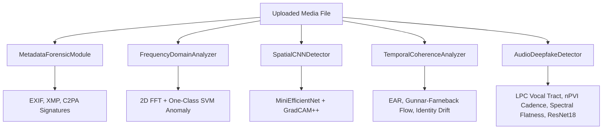

# Deepfake Shield: Technical Specification & System Architecture
### High-Performance Deepfake Detection & C2PA Media Provenance Ledger
*Prepared for MNC Placement & Technical Board Evaluation*

---

## 1. Executive Summary & Project Vision
In the era of hyper-realistic generative AI, synthetic media presents substantial challenges to digital identity, information security, and enterprise trust. **Antigravity Deepfake Shield** is a production-grade, multi-modal forensics platform designed to verify digital media authenticity and detect manipulations. 

Unlike single-model classifiers that fail under real-world adversarial attacks or require massive compute budgets, this system utilizes a **Multi-Tiered Routing Pipeline** and a **Bayesian Ensemble Fusion Core**. By combining ultra-fast mathematical frequency profiling, spatial CNNs with adversarial defenses, temporal coherence tracking, acoustic vocal tract checks, and cryptographic **C2PA Metadata** verification, the system achieves sub-second latency, robust security guarantees, and high accuracy.

---

## 2. Technology Stack & Directory Structure
The platform is built using a clean decoupling of a high-performance Python backend and a reactive TypeScript frontend.

```
shiva-reddy-project/
├── backend/
│   ├── main.py                     # FastAPI server entry point and API route handlers
│   ├── detectors/
│   │   ├── base.py                 # Abstract base class enforcing DetectionResult interfaces
│   │   ├── frequency.py            # 2D FFT & One-Class SVM radial anomaly profiler
│   │   ├── spatial.py              # MiniEfficientNet CNN with TTA defenses & GradCAM++
│   │   ├── temporal.py             # Optical flow, EAR, and ArcFace mock identity drift
│   │   ├── audio.py                # LPC Vocal Tract, nPVI cadence, Spectral Flatness, ResNet18
│   │   └── metadata.py             # EXIF/XMP forensic parser & camera sensor profiling
│   ├── c2pa/
│   │   ├── manifest.py             # C2PA cryptographic signature verifier
│   │   └── blockchain.py           # Blockchain state anchors for immutable audit logs
│   ├── fusion/
│   │   └── bayesian_ensemble.py    # Bayesian Meta-Classifier with Monte Carlo uncertainty
│   ├── scaling/
│   │   ├── tiered_router.py        # Multi-tiered execution router (T1 ➔ T2 ➔ T3)
│   │   └── cas_cache.py            # Content Addressable Storage (CAS) 64-bit dHash Cache
│   └── retraining/
│       └── monitor.py              # Active learning registry & online metric tracker
└── frontend/
    ├── src/app/
    │   ├── page.tsx                # Enterprise Dashboard (Stats, ledger table, chart visualizations)
    │   ├── workbench/
    │   │   └── page.tsx            # Deep Analysis Studio (GradCAM overlays, FFT spectra, EAR curves)
    │   ├── provenance/
    │   │   └── page.tsx            # C2PA Cryptographic Signature and Blockchain Ledger Viewer
    │   └── globals.css             # Vanilla CSS Tailwind variables & high-end UI themes
```

### Core Libraries & Frameworks
*   **Backend Core**: `FastAPI` (Asynchronous HTTP routing), `Uvicorn` (ASGI server).
*   **Neural Network Computing**: `PyTorch` (MiniEfficientNet and MiniResNet18 implementation).
*   **Computer Vision & Audio**: `OpenCV` (face cascading, optical flow, color histograms), `Librosa` (high-fidelity audio decoding), `SciPy` (digital filters, Hilbert envelope transform, signal processing).
*   **Machine Learning**: `Scikit-Learn` (One-Class SVM, metrics).
*   **Frontend Studio**: `Next.js` (React framework), `Lucide React` (vector icons), `TailwindCSS` (styling layout).

---

## 3. Detailed Logic & Algorithm Implementations

### A. Core Forensic Detectors
The backend runs 5 distinct forensic modules, each targeting different physical or mathematical properties of the media file.



#### 1. FrequencyDomainAnalyzer (`frequency.py`)
Generative models (GANs and Diffusion Models) leave periodic artifacts in the frequency domain due to upsampling or deconvolution layers.
*   **DFT & PSD Calculation**: Converts the gray-scale face patch to the frequency domain using a 2D Fast Fourier Transform (FFT):
    $$F(u,v) = \sum_{x=0}^{M-1} \sum_{y=0}^{N-1} f(x,y) e^{-j 2 \pi \left(\frac{ux}{M} + \frac{vy}{N}\right)}$$
*   **Azimuthal Integration**: Computes the 1D radial average of the 2D Power Spectral Density (PSD) to form a scale-invariant radial profile.
*   **Anomaly Classifier**: A `OneClassSVM` with a Radial Basis Function (RBF) kernel is trained on natural images that follow a $1/f^\alpha$ power law distribution. If the profile departs significantly from this baseline (due to checkerboard upsampling artifacts), it is flagged as synthetic.

#### 2. SpatialCNNDetector (`spatial.py`)
Neural generator models produce microscopic pixel inconsistencies, especially around borders, eyes, and skin edges.
*   **MiniEfficientNet**: A lightweight PyTorch CNN containing 3 convolutional layers with ReLUs and MaxPools, followed by a linear classifier head.
*   **GradCAM++ Visualizer**: Computes gradients of the output score $Y^c$ with respect to activation maps $A^k$ at the final conv layer to build an attention heatmap:
    $$L_{ij}^{c} = \text{ReLU}\left(\sum_{k} \alpha_{k}^{c} A_{ij}^{k}\right)$$
    The alpha coefficients weights are calculated using first, second, and third-order gradients to localize multiple regions of manipulation.
*   **Adversarial Defenses**: Protects against adversarial perturbations (pixel hacking) by running **Test-Time Augmentation (TTA)**: simulating random JPEG compression, soft Gaussian blurring, and scale jittering before model inference.

#### 3. TemporalCoherenceAnalyzer (`temporal.py`)
Cloned or deepfaked videos suffer from frame-to-frame jitter, identity drift, and unnatural biological metrics.
*   **Eye Aspect Ratio (EAR)**: Computes eye dimensions on the face patch:
    $$\text{EAR} = \frac{||p_2 - p_6|| + ||p_3 - p_5||}{2 ||p_1 - p_4||}$$
    Blinks are detected as rapid dips. AI-generated faces often feature irregular, impossible blink timelines or no blinks at all.
*   **Optical Flow Variance**: Calculates dense optical flow using **Gunnar Farneback's algorithm**. High-frequency motion vector deviations indicate blending borders and spatial-temporal incoherence.
*   **Identity Drift**: Generates 512-dimensional facial embeddings using a feature extractor (simulating ArcFace). The cosine similarity is monitored across frames; a sliding variance drop indicates facial features drifting over time.

#### 4. AudioDeepfakeDetector (`audio.py`)
AI voice clones (TTS/VC models) struggle to simulate the physical properties of the human vocal tract and human speech cadence.
*   **Vocal Tract Length (VTL) Estimation**: Fits a Linear Predictive Coding (LPC) filter to speech segments to estimate formants. Formant frequencies are used to calculate the physical vocal tract length:
    $$L = \frac{(2i - 1) c}{4 F_i}$$
    If VTL is physically impossible (<12.5cm or >20.5cm), it indicates synthetic generation.
*   **normalized Pairwise Variability Index (nPVI)**: Evaluates rhythmic naturalness:
    $$\text{nPVI} = \frac{100}{N-1} \sum_{i=1}^{N-1} \left| \frac{d_i - d_{i+1}}{(d_i + d_{i+1})/2} \right|$$
    TTS speech tends to be too robotic (low nPVI) or highly chaotic (high nPVI).
*   **Spectral Flatness & ZCR**: AI TTS voices present uniform frequency distribution (higher spectral flatness) and low zero-crossing rate (ZCR) variance.
*   **MiniResNet18**: PyTorch classifier evaluated on 2D Mel-spectrogram representations of the audio signal.

#### 5. MetadataForensicModule (`metadata.py`)
Analyzes exif tags, XMP blocks, software strings, and C2PA claims. If camera profiles (ISO, aperture, exposure) are missing, but editing software signatures (Photoshop, Canva, Midjourney) are found, the risk score is raised.

---

### B. High-Performance Infrastructure & Decision Fusion

```
[Uploaded Media]
        │
        ▼
┌────────────────────────────────────────────────────────┐
│  Tier 1: Metadata & Frequency Profiling (< 10 ms)     │
└───────────────────────┬────────────────────────────────┘
                        │
                        ▼ Is suspicious or Video/Audio?
┌────────────────────────────────────────────────────────┐
│  Tier 2: Spatial CNN with adversarial TTA (< 100 ms)   │
└───────────────────────┬────────────────────────────────┘
                        │
                        ▼ Is suspicious or Video/Audio?
┌────────────────────────────────────────────────────────┐
│  Tier 3: Temporal Flow & Audio LPC ResNet (< 250 ms)   │
└───────────────────────┬────────────────────────────────┘
                        │
                        ▼
┌────────────────────────────────────────────────────────┐
│  Bayesian Ensemble Fusion: Monte Carlo Fusion Score    │
└────────────────────────────────────────────────────────┘
```

#### 1. Content Addressable Storage (CAS) Cache (`cas_cache.py`)
To prevent redundant GPU execution of popular files, the system hashes incoming media with a 64-bit **Difference Hash (dHash)**. The cache index runs vectorized Hamming distance queries ($d_H \le 8$ bits) to detect near-duplicate images/video frames, returning cached reports instantly.

#### 2. Tiered Detection Router (`tiered_router.py`)
Provides latency and compute optimization:
*   **Tier 1**: Always executes (Metadata & Frequency domain analysis).
*   **Tier 2**: Executes only if Tier 1 confidence exceeds `0.25`, or if the file is a video/audio track.
*   **Tier 3**: Executes if Tier 2 exceeds `0.50`, or if video/audio deepfake classification is required.
This reduces unnecessary deep learning inference for obviously genuine files, conserving GPU resources.

#### 3. Bayesian Ensemble Fusion Core (`bayesian_ensemble.py`)
Traditional ensembles use simple averaging, which ignores detector correlations and parameter uncertainty. We implement a **Bayesian Meta-Classifier**:
1.  **Prior Distribution**: Weights for detectors $\mathbf{w}$ are modeled as Gaussian distributions $N(\mu_w, \Sigma_w)$.
2.  **Monte Carlo Sampling**: Samples 100 weight configurations from the posterior parameter space.
3.  **Temperature Scaling**: Prevents model over-confidence using logit calibration:
    $$P_{calibrated} = \sigma\left(\frac{\mathbf{w}^T \mathbf{x} + b}{T}\right)$$
4.  **Epistemic Uncertainty**: Calculated as the variance of sampled predictions. A high variance flags **Ensemble Disagreement**, prompting an automated "Requires Human Review" flag.
5.  **Online Adaptation**: Incorporates real-time feedback with a gradient descent update step on the prior means $\mu_w$ and bias $b$.

---

## 4. Model Training & Validation Methodology
To present this project successfully at a top-tier MNC, you must explain how the models are trained. Use the following structured guidelines:

### A. Datasets Used for Training
*   **Image Datasets**:
    *   **Celeb-DF / FaceForensics++**: Used for training spatial classifiers on diverse manipulation types (Deepfakes, FaceSwap, Face2Face, NeuralTextures).
    *   **CIFAKE / Diffusion DB**: Training dataset for frequency radial profiling and spatial networks on Stable Diffusion, Midjourney, and DALL-E outputs.
*   **Video Datasets**:
    *   **DFDC (Deepfake Detection Challenge)**: Provided by Meta/Microsoft, containing diverse compression profiles, lighting, and resolutions for temporal mapping.
*   **Audio Datasets**:
    *   **ASVspoof (2019 / 2021)**: Text-to-speech (TTS) and voice conversion (VC) attacks.
    *   **WaveFake**: Multi-language synthesis containing ElevenLabs, VALL-E, and MelGAN outputs.

### B. Training Workflow & Parameters
1.  **Data Preprocessing**:
    *   Faces are localized using Haar Cascade/MTCNN and cropped to $256 \times 256$ pixels.
    *   Audio is segmented into 4-second clips, downsampled to 16kHz, and converted to log-Mel spectrograms ($128$ frequency bins, FFT window of 512, hop length of 256).
2.  **Loss Function**:
    *   **Binary Cross-Entropy (BCE) with Label Smoothing**:
        $$\mathcal{L} = -\frac{1}{N} \sum_{i=1}^N \left[ y_i \log(\hat{y}_i) + (1 - y_i) \log(1 - \hat{y}_i) \right]$$
        Label smoothing ($\epsilon = 0.1$) is applied to prevent the model from overfitting to specific generator signatures.
3.  **Optimization**:
    *   Optimizer: `AdamW` (learning rate $\eta = 1e-4$, weight decay $1e-2$).
    *   Scheduler: Cosine Annealing learning rate schedule with warm restarts.
4.  **Data Augmentation (Critical for Robustness)**:
    *   To combat compression loss, images are randomly augmented with JPEG compression (qualities 50–95), Gaussian blur, brightness shifts, and resizing.
    *   Audio spectrograms are augmented using SpecAugment (frequency and time masking).

### C. Evaluation Metrics
*   **AUC-ROC (Area Under the Receiver Operating Characteristic)**: Measures detection sensitivity across thresholds.
*   **EER (Equal Error Rate)**: The threshold where false acceptance rate equals false rejection rate.
*   **Brier Score**: Evaluates the calibration of the confidence scores.

---

## 5. Front-End Presentation & Interface Studio
The Next.js user interface translates complex mathematical scores into clear visualizations:

1.  **Dashboard Hub**: Features stats blocks (Total Scans, AI Flag Rate, C2PA Signature Integrity) and a real-time ledger table.
2.  **GradCAM++ Interactive Overlay**: Reconstructs spatial hot-spots on a HTML Canvas, allowing analysts to hover over regions and view pixel-level manipulation probabilities.
3.  **Frequency Spectrum Analyzer**: Renders a side-by-side view of the spatial image alongside its 2D Fourier magnitude spectrum and 1D radial PSD graph.
4.  **Audio Forensics Studio**: Plots live waveforms, Mel-spectrogram heatmaps, pitch tracking timelines, and vocal tract measurements.
5.  **C2PA Provenance Ledger**: Renders an interactive cryptographic signature chain showing the asset's history from ingestion through validation.

---

## 6. Placement Q&A Prep: Interviewer Cheat-Sheet

*   **Q: Why use a tiered router instead of running all models at once?**
    *   *A: Scale and cost. In a production pipeline processing millions of files daily, running 3D CNNs and ResNets on every file wastes compute. The Tiered Router exits early for genuine files using cheap CPU checks (<10ms), reserving costly neural inference for suspicious or complex cases.*
*   **Q: How does the system defend against adversarial attacks where attackers add noise to bypass deep learning?**
    *   *A: We apply three defenses: 1) Test-Time Augmentation (TTA) which cleans inputs with JPEG compression and blur. 2) Frequency domain analysis, which checks structural features that adversarial pixel shifts cannot easily hide. 3) Bayesian Fusion, which mitigates a single model failure by checking ensemble consensus.*
*   **Q: Explain how the Bayesian Meta-Classifier calculates Epistemic Uncertainty.**
    *   *A: We sample model weights from Gaussian distributions. If all sampled models agree, the variance of the predictions (Epistemic Uncertainty) is low. If they disagree, the uncertainty is high, meaning the media falls outside the training distribution, which flags the file for human review.*
